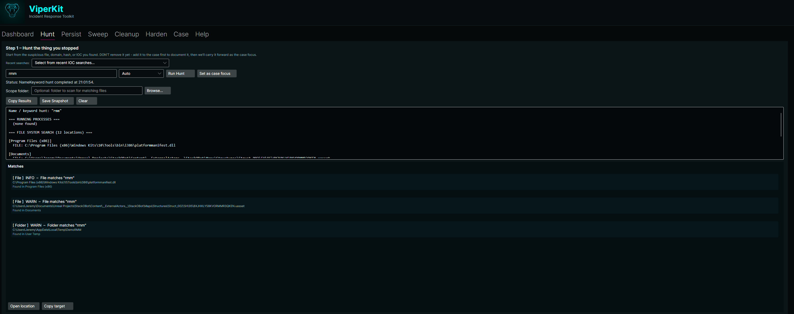
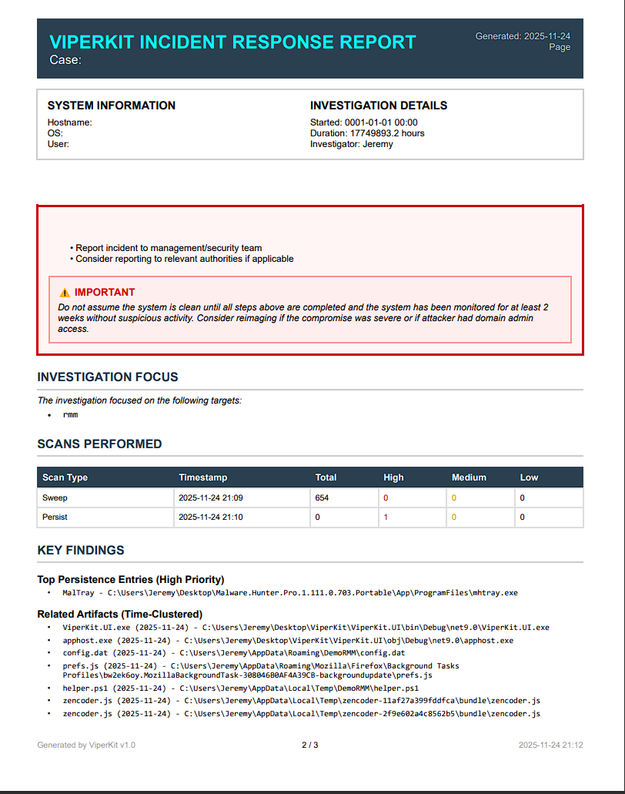

# ViperKit

<div align="center">


**Portable Incident Response Toolkit for Windows**

[]()
[]()
[]()
[](https://github.com/jtarkington77/VenomousViper)

</div>

---

## ⚠️ DISCLAIMER

**USE AT YOUR OWN RISK.** ViperKit is an open-source project provided AS-IS with NO WARRANTY or guarantee of issue resolution. The author is NOT responsible for any damages, data loss, or system issues resulting from the use of this tool. Always test in a safe environment and maintain backups before performing any remediation actions.

---

## 📋 Table of Contents

- [Overview](#overview)
- [Key Features](#key-features)
- [System Requirements](#system-requirements)
- [Installation](#installation)
- [Quick Start](#quick-start)
- [Workflow](#workflow)
- [Features by Tab](#features-by-tab)
- [Screenshots](#screenshots)
- [Documentation](#documentation)
- [Building from Source](#building-from-source)
- [Contributing](#contributing)
- [License](#license)

---

## Overview

**ViperKit** is a portable, offline-first **incident response toolkit** for Windows, designed for MSPs and IT teams without dedicated security staff.

### Target Users
- Tier 1/2 Help Desk Technicians
- MSP Engineers
- IT Staff with limited cybersecurity experience
- Security professionals needing portable IR tools

### What ViperKit Does

ViperKit provides a **guided incident workflow** that walks you from initial detection to complete remediation:

```
"I think this box is compromised"
    ↓ HUNT      → Find the suspicious tool/file
    ↓ PERSIST   → Discover persistence mechanisms
    ↓ SWEEP     → Find related artifacts (time clustering)
    ↓ CLEANUP   → Safely remove threats (with undo)
    ↓ HARDEN    → Apply security controls (planned)
    ↓ CASE      → Export complete documentation
```

### What ViperKit Is NOT

- ❌ Not an antivirus or EDR replacement
- ❌ Not automated malware removal
- ❌ Not cloud-dependent (works fully offline)
- ❌ Not a magic "fix everything" button

---

## Key Features

### 🔍 **Hunt Tab** - IOC Investigation
- **6 IOC Types**: File/Path, Hash, Domain/URL, IP, Registry, Name/Keyword
- File metadata extraction and multi-hash calculation (MD5/SHA1/SHA256)
- DNS lookups, HTTP probes, reverse DNS, ping tests
- Process enumeration and scoped file searches
- Set case focus to track targets across all tabs
- History dropdown remembers last 10 searches

### 🔐 **Persist Tab** - Persistence Discovery
- **Comprehensive coverage**: Registry Run keys, Services, Scheduled Tasks, Startup folders
- **High-signal detection**: IFEO debuggers, Winlogon hijacks, AppInit_DLLs, PowerShell profiles
- Risk assessment with color-coded badges (CHECK/NOTE/OK)
- MITRE ATT&CK technique mapping
- Publisher extraction from executables
- Focus highlighting with colored borders
- PowerShell history analysis (planned)

### 📡 **Sweep Tab** - Temporal Artifact Discovery
- Configurable lookback windows (24h, 3d, 7d, 30d)
- **Time clustering**: Find files created ±1-8h around suspicious activity
- **Folder clustering**: Detect related files in same directory
- Severity-based classification (HIGH/MEDIUM/LOW)
- VirusTotal integration for hash lookups
- Focus integration with multi-color highlighting

### 🧹 **Cleanup Tab** - Safe Threat Removal
- Quarantine files with full undo capability
- Disable services and scheduled tasks (reversible)
- Registry backup before deletion
- Journal-based tracking for audit trail
- Confirmation dialogs for destructive actions
- Preview before execute workflow

### 📊 **Case Tab** - Documentation & Export
- Chronological event timeline from all activities
- Focus targets tracking
- **Professional PDF reports** with:
  - Executive summary with risk breakdown
  - Critical next steps (password resets, monitoring, etc.)
  - Detailed findings with severity levels
  - Remediation actions taken
  - Timeline of key events
- Export to: PDF, Text, JSON logs

### 📚 **Help Tab** - Built-in Documentation
- Searchable help content
- Safety rules and best practices
- Tab-by-tab usage instructions
- FAQ section
- File locations reference

---

## System Requirements

### Minimum Requirements
- **OS**: Windows 10 (1809+) or Windows 11 / Windows Server 2019+
- **Runtime**: .NET 9.0 Runtime (or use self-contained exe)
- **Privileges**: **Administrator rights required**
- **RAM**: 512 MB minimum, 1 GB recommended
- **Disk**: 100 MB for application + space for quarantine

### Recommended
- **OS**: Windows 11 or Windows Server 2022
- **RAM**: 2 GB+
- **Disk**: 1 GB+ for quarantine and logs

### Administrator Privileges

⚠️ **ViperKit MUST be run as Administrator** to access:
- Registry keys (HKLM, IFEO, Winlogon)
- Services and drivers
- All user profiles
- Scheduled tasks
- System directories

**To run as admin**: Right-click `ViperKit.UI.exe` → **Run as Administrator**

---

## Installation

### Option 1: Portable Exe (Recommended)

1. Download the latest release from [Releases](https://github.com/jtarkington77/ViperKit/releases)
2. Extract to a folder (e.g., `C:\Tools\ViperKit`)
3. Right-click `ViperKit.UI.exe` → **Run as Administrator**

### Option 2: Build from Source

```bash
# Clone the repository
git clone https://github.com/jtarkington77/VenomousViper.git
cd VenomousViper/ViperKit.UI

# Build
dotnet build

# Run
dotnet run

# Or publish self-contained exe
dotnet publish -c Release -r win-x64 --self-contained true -p:PublishSingleFile=true
```

See [INSTALLATION.md](docs/INSTALLATION.md) for detailed instructions.

---

## Quick Start

### 1. Start a New Case
- Launch ViperKit as Administrator
- Dashboard → **Start New Case** (or load existing)
- Enter optional case name (e.g., "Ticket-12345")

### 2. Hunt for the Suspicious Item
- Go to **Hunt** tab
- Enter IOC: file path, domain, hash, etc.
- Click **Run Hunt**
- If found, click **Set as Case Focus**

### 3. Check Persistence
- Go to **Persist** tab
- Click **Run Persistence Scan**
- Review highlighted items matching your focus
- Add suspicious entries to cleanup queue

### 4. Find Related Artifacts
- Go to **Sweep** tab
- Select lookback window (e.g., 7 days)
- Click **Run Sweep**
- Review time-clustered files (orange borders)
- Add related items to focus and cleanup

### 5. Remove Threats
- Go to **Cleanup** tab
- Review queued items
- Click **Execute All** (confirmation dialog appears)
- Items are quarantined with full undo capability

### 6. Export Case Report
- Go to **Case** tab
- Click **Export Report**
- PDF saved to `Documents\ViperKit\Reports\`

---

## Workflow

### Core Concept: Case Focus

**Case Focus** is a global list of suspicious targets that follows you across all tabs. When you find something suspicious, add it to focus and it highlights everywhere.

```
Examples:
- ConnectWiseControl.Client.exe
- malware.exe
- powershell.exe
- suspicious-script.ps1
```

### Example: Rogue RMM Cleanup

**Scenario**: Attacker installed ScreenConnect that keeps reappearing after uninstall.

```
1. HUNT    → Search "ScreenConnect"
             → Find: ScreenConnect.ClientService.exe
             → Set as case focus

2. PERSIST → Run scan
             → See: ScreenConnect service (highlighted)
             → See: Scheduled task for ScreenConnect
             → Add to cleanup queue

3. SWEEP   → Run 7-day scan with ±2h cluster window
             → See: ScreenConnect.Setup.msi (TIME CLUSTER)
             → See: helper.ps1 in AppData (TIME CLUSTER)
             → Add to focus

4. PERSIST → Re-run scan with expanded focus
             → See: Additional persistence for new items

5. CLEANUP → Review queue (service + task + files)
             → Execute cleanup
             → All items quarantined/disabled

6. CASE    → Export PDF report
             → Complete documentation for ticket
```

---

## Features by Tab

### Dashboard
- System snapshot (hostname, user, OS version)
- Case management (start new / load existing)
- Admin privilege detection with warning banner
- Baseline capture and comparison
- Case summary with event counts

### Hunt
- **IOC Types**: Auto-detect, File/Path, Hash, Domain/URL, IP, Registry, Name/Keyword
- Structured results with severity levels
- Hash calculation (MD5, SHA1, SHA256)
- Network probes (DNS, HTTP, ping)
- Process and file system searches
- Hunt history dropdown (last 10 searches)
- Add to case focus

### Persist
- **Registry**: Run/RunOnce (HKCU/HKLM + Wow6432Node)
- **Winlogon**: Shell/Userinit hijacks
- **IFEO**: Debugger hijacks
- **AppInit_DLLs**: DLL injection points
- **Services & Drivers**: Auto-start only
- **Scheduled Tasks**: All enabled tasks
- **Startup Folders**: All users + current user
- **PowerShell Profiles**: All profile locations
- Risk assessment with color badges
- MITRE ATT&CK mapping
- Publisher extraction
- Focus highlighting

### Sweep
- Lookback windows: 24h, 3d, 7d, 30d
- Scan locations: User profiles, ProgramData, Startup, Services
- File types: Executables, DLLs, scripts, installers, archives
- **Severity levels**: HIGH / MEDIUM / LOW
- **Time clustering**: ±1h, ±2h, ±4h, ±8h configurable
- **Focus highlighting**:
  - Pink border: Focus term match
  - Orange border: Time cluster
  - Blue border: Folder cluster
- VirusTotal integration
- Add to cleanup queue

### Cleanup
- Queue items from Persist and Sweep
- **Actions**:
  - Quarantine files (with undo)
  - Disable services (reversible)
  - Disable scheduled tasks (reversible)
  - Backup and delete registry keys (restorable)
- Confirmation dialogs for destructive actions
- Execute all / execute selected
- Undo last / undo selected
- Journal tracking for audit trail
- Stats display (total, pending, completed, failed)

### Case
- Chronological event timeline
- Focus targets display
- **Export formats**:
  - Professional PDF report
  - Text file export
  - JSON event logs
- PDF report includes:
  - Executive summary
  - Critical next steps
  - Findings by severity
  - Actions taken
  - Timeline

### Help
- Searchable documentation
- Safety rules (highlighted)
- Quick start guide
- Tab-by-tab instructions
- Tips & best practices
- FAQ
- File locations

---

## Screenshots

### Dashboard

*Main dashboard showing case management and system snapshot*

### Hunt Tab

*IOC search with structured results and focus highlighting*

### Persist Tab

*Persistence mechanisms with risk assessment and focus highlighting*

### Sweep Tab

*Temporal clustering showing related files installed around the same time*

### Cleanup Tab

*Remediation queue with confirmation dialogs*

### PDF Report

*Professional PDF report with executive summary and findings*

---

## Documentation

- **[Installation Guide](docs/INSTALLATION.md)** - Detailed installation and setup
- **[User Guide](docs/USER_GUIDE.md)** - Comprehensive usage instructions
- **[Architecture](docs/ARCHITECTURE.md)** - Technical implementation details
- **[Blueprint](ViperKit.UI/docs/ViperKit-Blueprint.md)** - Original design document
- **[PLAN](PLAN.md)** - Feature scope and milestones
- **[CHANGELOG](CHANGELOG.md)** - Version history

---

## Building from Source

### Prerequisites
- .NET 9.0 SDK
- Git
- Windows 10/11 or Windows Server 2019+

### Build Steps

```bash
# Clone repository
git clone https://github.com/jtarkington77/VenomousViper.git
cd VenomousViper/ViperKit.UI

# Restore dependencies
dotnet restore

# Build
dotnet build -c Release

# Run
dotnet run

# Create portable exe
dotnet publish -c Release -r win-x64 --self-contained true -p:PublishSingleFile=true -p:PublishTrimmed=false
```

Output: `ViperKit.UI\bin\Release\net9.0\win-x64\publish\ViperKit.UI.exe`

---

## Contributing

This is an open-source project. Contributions are welcome!

### Reporting Issues
- Report bugs and feature requests on [GitHub Issues](https://github.com/jtarkington77/VenomousViper/issues)
- Use at your own risk - no warranty or guarantee of issue resolution

### Development
- Follow existing code style
- Test thoroughly before submitting PRs
- Update documentation for new features

See [CONTRIBUTING.md](CONTRIBUTING.md) for detailed guidelines (coming soon).

---

## File Locations

### Case Data
- **Case files**: `C:\ProgramData\ViperKit\Cases\{CaseId}\`
- **Case events**: `case_events.json`
- **Cleanup journal**: `cleanup_journal.json`

### Exports
- **PDF reports**: `Documents\ViperKit\Reports\`
- **Text exports**: `Documents\ViperKit\Exports\`
- **Baselines**: `C:\ProgramData\ViperKit\Baselines\`

### Quarantine
- **Quarantined files**: `Documents\ViperKit\Quarantine\{CaseId}\`

### Hunt History
- **Search history**: `%APPDATA%\ViperKit\hunt_history.txt`

---

## Planned Features

### Near-term
- ✅ Hunt history dropdown - **DONE**
- ✅ Confirmation dialogs - **DONE**
- ✅ PDF report generation - **DONE**
- ⏳ PowerShell history analysis
- ⏳ Harden tab (security profiles)

### Future
- Demo mode (training walkthrough)
- Enhanced HTML reports
- Artifacts ZIP export
- Baseline monitoring dashboard
- Network connection tracking

---

## Tech Stack

- **.NET 9.0** - Modern .NET runtime
- **Avalonia UI** - Cross-platform UI framework
- **QuestPDF** - Professional PDF generation
- **C#** - Primary language
- **Windows APIs** - Registry, Services, WMI, Task Scheduler

---

## License

**Proprietary License** - VENOMOUSVIPER / Jeremy Tarkington

This is an open-source project provided AS-IS for educational and professional use. See disclaimer at top.

---

## Support & Contact

- **GitHub**: [VenomousViper](https://github.com/jtarkington77/VenomousViper)
- **Issues**: [Report bugs and request features](https://github.com/jtarkington77/VenomousViper/issues)
- **Disclaimer**: Use at your own risk - no warranty or guarantee of support

---

## Acknowledgments

Built for MSPs, IT teams, and security professionals who need portable incident response tools.

**VENOMOUSVIPER** - Professional cybersecurity tooling

---

<div align="center">

**⚠️ Always run ViperKit as Administrator**

**⚠️ Always export case report before remediation**

**⚠️ Always maintain backups**

**⚠️ Never assume system is clean - monitor for 2-4 weeks**

[Download Latest Release](https://github.com/jtarkington77/VenomousViper/releases) | [Documentation](docs/) | [Report Issue](https://github.com/jtarkington77/VenomousViper/issues)

</div>
